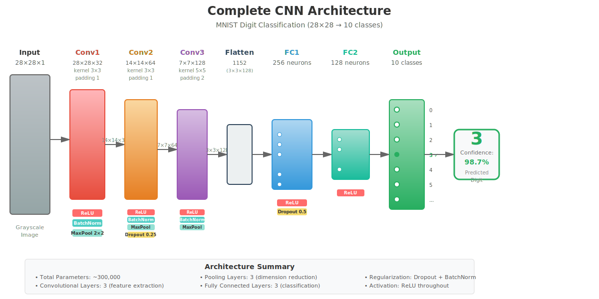
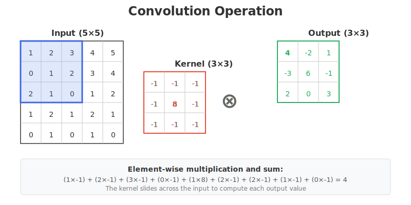
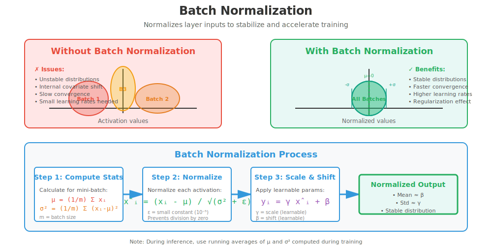
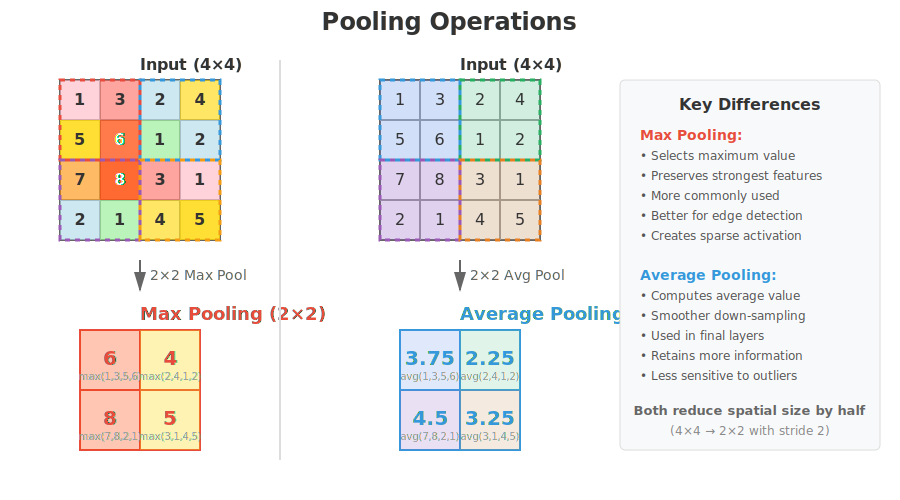
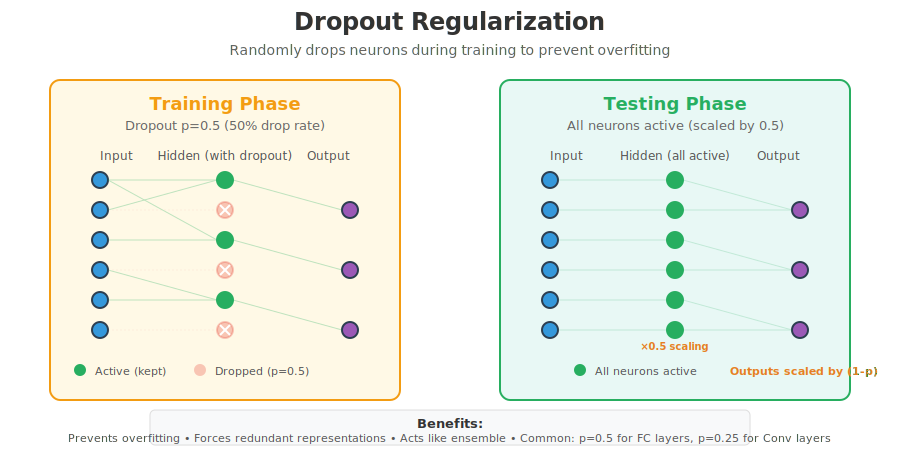
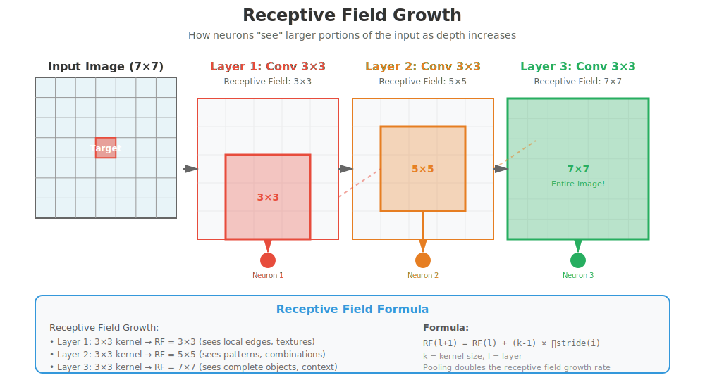
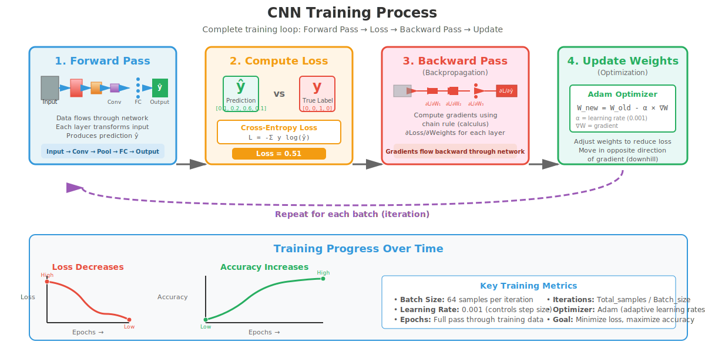

# Comprehensive CNN Concepts Guide

This document provides detailed explanations of all the key concepts demonstrated in the CNN example.



---

## 1. Convolutional Layers



**What they do:** Convolutional layers are the core building blocks of CNNs. They apply learnable filters (kernels) to the input to extract features.

**How they work:**
- A filter (e.g., 3×3) slides across the input image
- At each position, element-wise multiplication is performed
- Results are summed to produce one value in the output feature map
- Multiple filters create multiple feature maps

**Parameters:**
- `in_channels`: Number of input channels (1 for grayscale, 3 for RGB)
- `out_channels`: Number of filters/feature maps to learn
- `kernel_size`: Size of the filter (e.g., 3×3, 5×5)
- `stride`: How many pixels the filter moves each step
- `padding`: Zeros added around the input to control output size

**Example in code:**
```python
self.conv1 = nn.Conv2d(in_channels=1, out_channels=32, kernel_size=3, padding=1)
```

**Why they're important:**
- Early layers detect simple features (edges, corners)
- Deeper layers combine features to detect complex patterns
- Spatial relationships are preserved

---

## 2. Batch Normalization



**What it does:** Normalizes the inputs of each layer to have zero mean and unit variance.

**How it works:**
- For each mini-batch, compute mean and variance
- Normalize the activations
- Scale and shift with learnable parameters

**Benefits:**
- Stabilizes training (allows higher learning rates)
- Reduces internal covariate shift
- Acts as a regularizer (slight reduction in overfitting)
- Speeds up convergence

**Example in code:**
```python
self.bn1 = nn.BatchNorm2d(32)  # 32 is the number of channels
```

**When to use:**
- After convolutional layers (before or after activation)
- Especially useful in deep networks

---

## 3. Pooling Layers



**What they do:** Reduce the spatial dimensions (width and height) of feature maps while retaining important information.

**Types:**

### Max Pooling
- Takes the maximum value in each pooling window
- Preserves the strongest features
- Most commonly used

### Average Pooling
- Takes the average value in each pooling window
- Provides smoother down-sampling
- Often used in final layers

**Benefits:**
- Reduces computational cost
- Provides translation invariance
- Helps prevent overfitting
- Increases receptive field

**Example in code:**
```python
self.pool = nn.MaxPool2d(kernel_size=2, stride=2)  # Reduces size by half
```

**Visual Example:**
```
Input (4×4):          Max Pooling (2×2):
1  3  2  4           6  4
5  6  1  2     →     8  5
7  8  3  1
2  1  4  5
```

---

## 4. Activation Functions (ReLU)


**What they do:** Introduce non-linearity into the network, allowing it to learn complex patterns.

**ReLU (Rectified Linear Unit):**
- Formula: `f(x) = max(0, x)`
- Most popular activation function in CNNs
- Sets negative values to zero, keeps positive values unchanged

**Benefits:**
- Fast to compute
- Helps mitigate vanishing gradient problem
- Sparse activation (some neurons output zero)
- Allows network to learn non-linear relationships

**Other activation functions:**
- **Sigmoid**: `f(x) = 1/(1+e^(-x))` - outputs between 0 and 1
- **Tanh**: `f(x) = tanh(x)` - outputs between -1 and 1
- **Leaky ReLU**: `f(x) = max(0.01x, x)` - allows small negative values

**Example in code:**
```python
x = F.relu(x)
```

---

## 5. Dropout



**What it does:** Randomly "drops" (sets to zero) a fraction of neurons during training.

**How it works:**
- During training: Each neuron has probability `p` of being dropped
- During testing: All neurons are active, outputs scaled by `(1-p)`

**Benefits:**
- Prevents overfitting
- Forces network to learn redundant representations
- Acts like an ensemble of networks

**Common dropout rates:**
- `p=0.25` or `p=0.3` after convolutional layers
- `p=0.5` after fully connected layers

**Example in code:**
```python
self.dropout1 = nn.Dropout(p=0.25)  # Drop 25% of neurons
```

**When to use:**
- When you have limited training data
- In deeper networks prone to overfitting
- Not typically needed with batch normalization

---

## 6. Fully Connected (Dense) Layers

**What they do:** Connect every neuron in one layer to every neuron in the next layer.

**Role in CNNs:**
- Come after convolutional and pooling layers
- Perform the final classification based on extracted features
- Take flattened feature vectors as input

**Structure:**
- Input: Flattened feature maps from conv layers
- Hidden layers: Learn combinations of features
- Output layer: Produces class probabilities

**Example in code:**
```python
self.fc1 = nn.Linear(128 * 3 * 3, 256)  # Input size → Output size
self.fc2 = nn.Linear(256, 128)
self.fc3 = nn.Linear(128, num_classes)
```

**Size calculation:**
After 3 pooling operations on 28×28 image: 28 → 14 → 7 → 3
With 128 channels: 128 × 3 × 3 = 1,152 input features

---

## 7. Feature Maps


**What they are:** The output of applying filters to an input or previous layer.

**Characteristics:**
- Each filter produces one feature map
- Early layers: Simple features (edges, textures)
- Middle layers: Patterns and shapes
- Deep layers: Complex objects and concepts

**Dimensions:**
- Height and width: Reduced by pooling
- Depth (channels): Controlled by number of filters

**Example:**
- Input: (1, 28, 28) - 1 grayscale image, 28×28 pixels
- After Conv1: (32, 28, 28) - 32 feature maps
- After Pool1: (32, 14, 14) - spatial size reduced
- After Conv2: (64, 14, 14) - 64 feature maps

---

## 8. Receptive Field



**What it is:** The region of the input image that influences a particular neuron's activation.

**How it grows:**
- Each conv layer increases the receptive field
- Pooling layers also increase it
- Deeper neurons "see" larger portions of the input

**Example:**
- Layer 1: 3×3 receptive field (sees 3×3 pixels)
- Layer 2: 5×5 receptive field (after pooling)
- Layer 3: 9×9 receptive field (after another pooling)

**Why it matters:**
- Determines what scale of features can be detected
- Larger receptive fields capture more context
- Need sufficient depth to capture whole objects

---

## 9. Filter/Kernel Visualization

**What filters learn:**
- **First layer**: Edge detectors, color blobs, simple textures
- **Middle layers**: Patterns, corners, curves
- **Deep layers**: Object parts, complex shapes

**Common first-layer filters:**
- Horizontal edge detector
- Vertical edge detector
- Diagonal edges
- Color gradients

**Why visualize:**
- Understand what the network learns
- Debug training issues
- Interpret model behavior

---

## 10. Training Process



**Steps in each iteration:**

1. **Forward Pass**: Input flows through network → predictions
2. **Loss Calculation**: Compare predictions to true labels
3. **Backward Pass**: Calculate gradients (how to adjust weights)
4. **Weight Update**: Adjust weights using optimizer

**Key components:**

### Loss Function
- Measures how wrong the predictions are
- **Cross-Entropy Loss**: Standard for classification
  - Combines softmax and negative log-likelihood
  - Penalizes confident wrong predictions heavily

### Optimizer
- Determines how weights are updated
- **SGD**: Basic gradient descent
- **Adam**: Adaptive learning rates (most popular)
  - Combines momentum and RMSprop
  - Works well with default parameters

### Learning Rate
- Controls size of weight updates
- Too high: Training unstable
- Too low: Training very slow
- **Learning Rate Scheduling**: Reduce over time
  - Start with larger steps
  - Fine-tune with smaller steps

---

## 11. Data Preprocessing

**Why it's important:**
- Neural networks work best with normalized data
- Ensures stable training
- Helps with convergence

**Common preprocessing steps:**

### Normalization
- Scale pixel values to [0, 1] or [-1, 1]
- Subtract mean, divide by standard deviation
- Per-channel normalization for RGB images

**Example:**
```python
transform = transforms.Compose([
    transforms.ToTensor(),  # Converts to [0, 1]
    transforms.Normalize((0.1307,), (0.3081,))  # Normalize with dataset mean/std
])
```

### Data Augmentation (not in basic example)
- Random crops
- Random flips
- Random rotations
- Color jittering
- Increases effective training data

---

## 12. Batch Processing

**What it is:** Processing multiple samples simultaneously.

**Benefits:**
- **Faster training**: Parallel computation on GPU
- **Stable gradients**: Average over multiple samples
- **Memory efficient**: More efficient than one-by-one

**Batch size considerations:**
- **Small batches (16-32)**: Noisy gradients, regularization effect
- **Large batches (128-256)**: Stable gradients, faster convergence
- **Memory constraints**: Larger batches need more GPU memory

**Example:**
```python
train_loader = DataLoader(dataset, batch_size=64, shuffle=True)
```

---

## 13. Overfitting vs Underfitting

**Overfitting:**
- Model memorizes training data
- Poor performance on new data
- Signs: High training accuracy, low test accuracy

**Prevention:**
- Dropout
- Batch normalization
- Data augmentation
- Early stopping
- Regularization (L1, L2)

**Underfitting:**
- Model too simple to learn patterns
- Poor performance on both training and test data

**Solutions:**
- Increase model capacity (more layers/filters)
- Train longer
- Reduce regularization

---

## 14. Model Evaluation

**Metrics:**

### Accuracy
- Percentage of correct predictions
- Good for balanced datasets

### Confusion Matrix
- Shows true positives, false positives, etc.
- Reveals class-specific performance

### Per-class metrics
- Precision: Of predicted positives, how many are correct?
- Recall: Of actual positives, how many were found?
- F1-score: Harmonic mean of precision and recall

**Best practices:**
- Use separate test set (never trained on)
- Cross-validation for small datasets
- Monitor multiple metrics

---

## 15. Hyperparameters

**Architecture hyperparameters:**
- Number of layers
- Number of filters per layer
- Filter sizes
- Stride and padding values

**Training hyperparameters:**
- Learning rate (most important!)
- Batch size
- Number of epochs
- Optimizer choice
- Dropout rate

**How to tune:**
- Start with proven architectures
- Use learning rate finders
- Grid search or random search
- Bayesian optimization for efficiency

---

## 16. GPU Acceleration

**Why use GPUs:**
- CNNs involve many matrix operations
- GPUs excel at parallel computation
- 10-100x speedup over CPU

**In PyTorch:**
```python
device = torch.device("cuda" if torch.cuda.is_available() else "cpu")
model = model.to(device)
data = data.to(device)
```

**Memory management:**
- Monitor GPU memory usage
- Reduce batch size if out of memory
- Use mixed precision training (FP16)

---

## 17. Transfer Learning (Advanced)

**Concept:** Use pre-trained models as starting point.

**Benefits:**
- Faster training
- Better performance with less data
- Leverage features learned from millions of images

**Common pre-trained models:**
- ResNet
- VGG
- Inception
- EfficientNet

**Approaches:**
1. **Feature extraction**: Freeze early layers, train final layers
2. **Fine-tuning**: Unfreeze and retrain with small learning rate

---

## 18. Common CNN Architectures

**LeNet (1998):**
- First successful CNN
- 2 conv layers, 2 FC layers
- Used for digit recognition

**AlexNet (2012):**
- Won ImageNet competition
- 5 conv layers, 3 FC layers
- Introduced ReLU and dropout

**VGGNet (2014):**
- Very deep (16-19 layers)
- Small 3×3 filters throughout
- Simple architecture

**ResNet (2015):**
- Introduced skip connections
- Enables training very deep networks (50-152 layers)
- State-of-the-art performance

**Modern architectures:**
- EfficientNet: Optimized scaling
- MobileNet: Efficient for mobile devices
- Vision Transformers: Non-convolutional approach

---

## Tips for Success

1. **Start simple**: Get a basic model working first
2. **Visualize everything**: Losses, accuracies, feature maps
3. **Monitor training**: Watch for overfitting/underfitting
4. **Use proven architectures**: Don't reinvent the wheel
5. **Normalize inputs**: Critical for stable training
6. **Use appropriate learning rates**: Too high = unstable, too low = slow
7. **Save checkpoints**: Don't lose progress from crashes
8. **Experiment systematically**: Change one thing at a time
9. **Use data augmentation**: Especially with limited data
10. **Read papers**: Learn from state-of-the-art research

---

## Common Issues and Solutions

**Problem: Training loss not decreasing**
- Check learning rate (probably too low or too high)
- Verify data preprocessing
- Check for bugs in model architecture

**Problem: Overfitting (training acc high, test acc low)**
- Add dropout
- Add data augmentation
- Use batch normalization
- Get more training data
- Reduce model complexity

**Problem: Underfitting (both accuracies low)**
- Increase model capacity
- Train longer
- Reduce regularization
- Check data quality

**Problem: GPU out of memory**
- Reduce batch size
- Reduce model size
- Use gradient accumulation
- Use mixed precision training

---

## Resources for Further Learning

**Books:**
- "Deep Learning" by Goodfellow, Bengio, and Courville
- "Dive into Deep Learning" by Zhang et al. (free online)

**Courses:**
- Stanford CS231n: Convolutional Neural Networks
- Fast.ai Practical Deep Learning course
- Andrew Ng's Deep Learning Specialization

**Papers:**
- ImageNet Classification with Deep CNNs (AlexNet)
- Very Deep CNNs for Large-Scale Image Recognition (VGG)
- Deep Residual Learning for Image Recognition (ResNet)

**Websites:**
- PyTorch tutorials and documentation
- Papers with Code (latest research + code)
- Distill.pub (visual explanations)

---

*This guide covers all concepts demonstrated in the accompanying CNN example code.*
